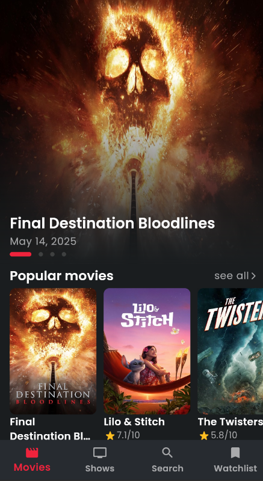
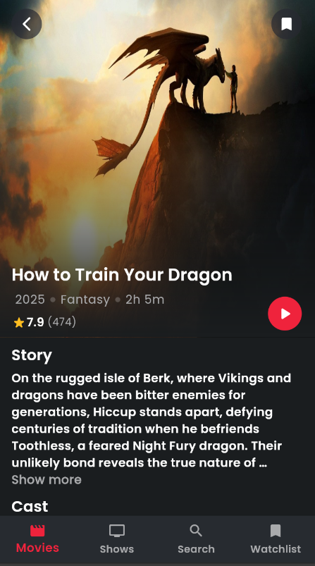
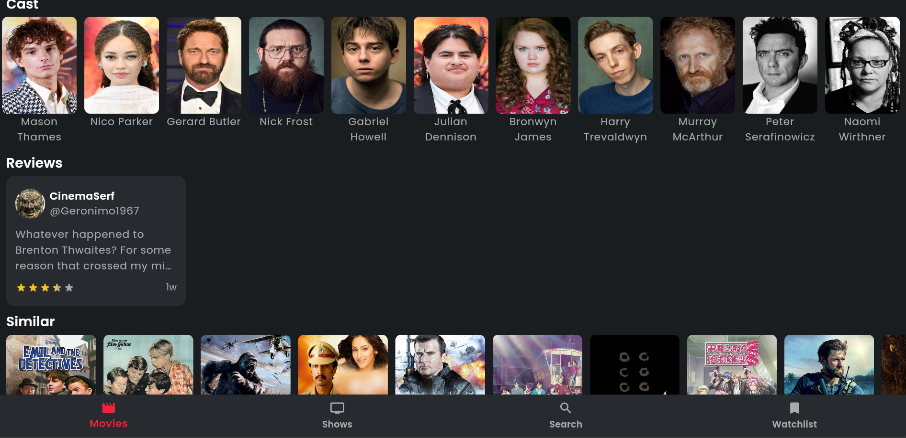
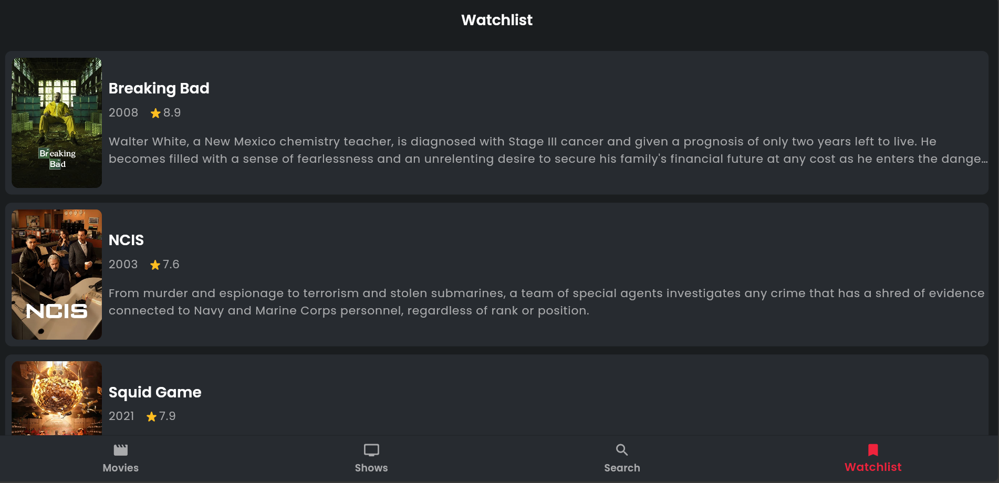

# 🎬 FilmHub

FilmHub is a movie and TV show discovery app built with Flutter using clean architecture principles.The application also utilize a responsive design.

## 🚀 Features

- Browse movies and TV shows
- Explore celebrities.
- Search functionality
- Add to watchlist
- Organized with Clean Architecture (Presentation, Domain, Data layers)

## 🖼️ Preview

### phone preview


### big screens preview

---


## 🛠️ Built With

- Flutter
- Dart
- TMDb API (or any other API you're using)
- Clean Architecture

## 📦 Installation

1. Clone the repo:
   ```bash
   git clone https://github.com/noone-m/filmhub.git
   cd filmhub


A few resources to get you started if this is your first Flutter project:

- [Lab: Write your first Flutter app](https://docs.flutter.dev/get-started/codelab)
- [Cookbook: Useful Flutter samples](https://docs.flutter.dev/cookbook)

For help getting started with Flutter development, view the
[online documentation](https://docs.flutter.dev/), which offers tutorials,
samples, guidance on mobile development, and a full API reference.
